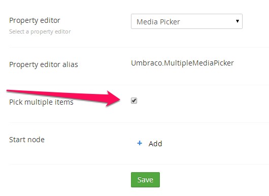

# Multiple Media Picker #

`Alias: Umbraco.MultipleMediaPicker`

`Returns: IEnumerable<IPublishedContent>` or `IPublishedContent`

This converter returns a single item if the "Pick multiple items" data type setting is disabled or a collection if it is enabled.



## Typed Example (multiple enabled): ##

```c#
    @{
        var typedMultiMediaPicker = Model.Content.GetPropertyValue<IEnumerable<IPublishedContent>>("multiMedia");
        foreach (var item in typedMultiMediaPicker)
        {
            
        }
    }
```

## Typed Example (multiple disabled): ##

```c#
    @{
        var typedMediaPickerSingle = Model.Content.GetPropertyValue<IPublishedContent>("multiMediaSingle");
        if (typedMediaPickerSingle != null)
        {
            <p>@typedMediaPickerSingle.Url</p>
            
        }
    }      
```

## Dynamic Example (multiple enabled): ##

```c#
    @{
        var dynamicMultiMediaPicker = CurrentPage.multiMedia;
        foreach (var item in dynamicMultiMediaPicker)
        {
            
        }
    }       
```


## Dynamic Example (multiple disabled): ##

```c#
    @{
        if (CurrentPage.HasValue("multiMediaSingle"))
        {
            var dynamicMediaPickerSingle = CurrentPage.multiMediaSingle;
            
        }
    }    
```